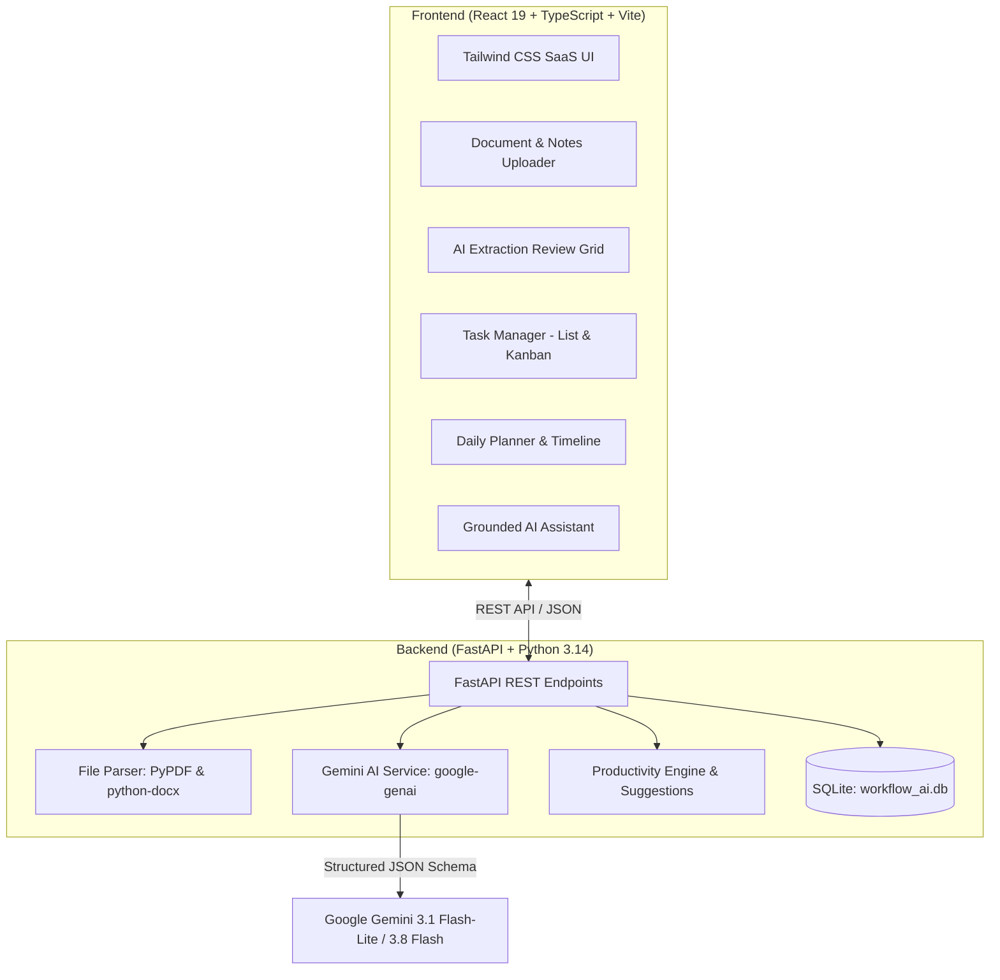

# WorkFlow AI ⚡
> Autonomous AI-powered productivity agent that converts unstructured meeting notes, text, and uploaded documents into prioritized tasks, deadlines, subtasks, and an optimized daily schedule.

---

## 🌟 Highlights & Key Capabilities

- **🧠 Multi-Model Gemini Intelligence**: Powered by Google Gemini (`gemini-3.1-flash-lite` and `gemini-3.8-flash`) via the official `google-genai` Python SDK with strict Pydantic v2 structured JSON outputs.
- **🌐 100% Domain-Independent**: Seamlessly extracts structured tasks from any domain — software sprint notes, hospital clinical briefings, commercial culinary schedules, civil construction logs, legal briefs, and more.
- **📄 Native Document Ingestion**: Upload `.pdf` and `.docx` documents or paste raw text. Built-in `pypdf` and `python-docx` extract and process text autonomously.
- **🔍 Interactive Review Screen**: Review extracted tasks as cards before committing them to the database — edit priorities, assignees, deadlines, estimated minutes, delete items, or add manual tasks.
- **📊 Polished SaaS Dashboard**: Real-time progress tracking, 4 core metric cards (Total, High Priority, Completed, Overdue), upcoming deadlines, and proactive AI suggestion alerts.
- **📅 AI Daily Planner & Timeline**: Generates a realistic, chronological time-blocked schedule with focus slots, buffers, and breaks based on task priorities, deadlines, and working hours.
- **💬 Grounded AI Assistant**: Conversational assistant strictly grounded in the live SQLite task database. Ask *"What should I do first?"*, *"What tasks are overdue?"*, *"I have only 2 hours today, what should I complete?"*, or *"Create a message for my team"*.
- **⚡ Task Breakdown**: Break down any complex task into 3–6 actionable, domain-specific subtasks with one click.
- **🎯 Clean Architecture**: Clean separation between frontend (React + Vite + TypeScript + Tailwind CSS) and backend (FastAPI + SQLAlchemy + SQLite).

---

## 🏗️ Architecture & Tech Stack



### Stack Components
- **Frontend**: React 19, TypeScript, Vite, Tailwind CSS, Lucide Icons, Canvas Confetti.
- **Backend**: Python 3.14, FastAPI, Uvicorn, SQLAlchemy 2.0, SQLite, Pydantic v2.
- **AI / LLM**: `google-genai` SDK, `gemini-3.1-flash-lite`, `gemini-3.8-flash`.
- **Document Processing**: `pypdf`, `python-docx`, `python-multipart`.

---

## 🚀 Quick Start

### 1. Configure Gemini API Key
Create or edit `backend/.env`:
```env
GEMINI_API_KEY=your_actual_gemini_api_key_here
PORT=8000
HOST=0.0.0.0
CORS_ORIGINS=http://localhost:5173,http://127.0.0.1:5173
```

### 2. Launch with One Click (Windows)
Double-click `start_all.bat` or run in terminal:
```powershell
.\start_all.bat
```
This automatically starts:
- **Backend API**: `http://localhost:8000` (Swagger UI at `http://localhost:8000/docs`)
- **Frontend App**: `http://localhost:5173`

---

### Manual Launch

#### Backend
```powershell
cd backend
.\venv\Scripts\activate
uvicorn backend.app.main:app --host 0.0.0.0 --port 8000 --reload
```

#### Frontend
```powershell
cd frontend
npm run dev
```

---

## 🧪 Automated Test Suite

Run the domain independence and grounding test suites:

```powershell
# Test 1: Dynamic task extraction across 3 completely distinct domains (Hospital, Culinary, Construction)
$env:PYTHONPATH="."
.\backend\venv\Scripts\python backend/tests/test_dynamic_domains.py

# Test 2: AI Planner and Grounded Assistant domain verification
.\backend\venv\Scripts\python backend/tests/test_planner_and_assistant.py
```

---

## 📋 API Endpoints Summary

| Method | Endpoint | Description |
| :--- | :--- | :--- |
| `GET` | `/api/dashboard` | Dashboard metrics, progress rate, today's queue, deadlines, AI suggestions |
| `GET` | `/api/tasks` | List tasks with filters (`status`, `priority`, `category`, `assignee`, `search`) |
| `POST` | `/api/tasks` | Create a new task manually |
| `POST` | `/api/tasks/batch` | Batch approve and save extracted tasks from the review screen |
| `PUT` | `/api/tasks/{id}` | Update task attributes |
| `DELETE`| `/api/tasks/{id}` | Delete task |
| `POST` | `/api/tasks/{id}/breakdown` | AI subtask decomposition for a specific task |
| `POST` | `/api/tasks/{id}/subtasks/{subtask_id}/toggle` | Check off a subtask |
| `POST` | `/api/analyze` | AI extraction from raw meeting notes or text |
| `POST` | `/api/upload` | Upload `.pdf` / `.docx` file, extract text, and analyze |
| `POST` | `/api/plan` | Generate AI time-blocked daily schedule |
| `POST` | `/api/assistant` | Chat with AI assistant grounded in SQLite task database |
| `POST` | `/api/demo/seed` | Explicitly load demo workspace scenario |
| `GET` | `/api/health` | System health check and Gemini API status |
